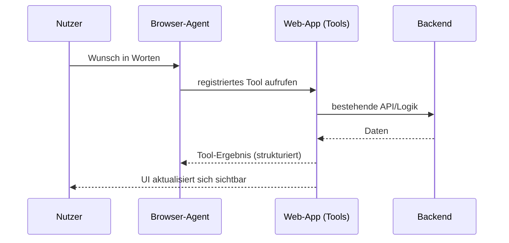

# Der DOM ist keine API

<div class="text-5xl leading-relaxed mt-12">
  Webseiten sind für <span class="text-primary font-bold">Menschen</span> gebaut.
  Was passiert, wenn ein Agent sie bedient?
</div>

<div class="mt-12 text-xl opacity-70">
  WebMCP für KI-Agenten · DevCon Lozärn · Oktober 2026
</div>

<!--
Titel als technische These. Der Untertitel setzt die Story: Webseiten sind für
Menschen gebaut, aber immer mehr Software (Agents) bedient sie ebenfalls.

Publikum sind Entwicklerinnen und Entwickler mit Interesse an AI Agents und der
Web-Plattform. Also: konkret, mit Demos und Code, ohne Marketing-Ton.

Timing: 0:00-0:20
-->

---
layout: center
class: text-left
transition: slide-up
---

<div class="text-sm tracking-widest uppercase opacity-55">Der Ausgangspunkt</div>

<div class="text-5xl leading-relaxed mt-6">
Jede Webseite ist eine Übersetzung:
<span class="text-primary font-bold">Absicht → Klicks, Felder, Listen.</span>
</div>

<div v-click class="mt-10 text-xl opacity-75">
Ein Mensch macht diese Übersetzung im Kopf. Software muss sie erst rekonstruieren.
</div>

<div class="mt-10">
  <Placeholder kind="image" h="12rem"
    label="Foto/Illustration: Person filtert Wanderungen in Trailfolk am Laptop" />
</div>

<!--
Der Hook: Webseiten sind für Menschen gebaut. Die Übersetzung von Absicht in
UI-Zustand machen wir als Menschen mühelos. Genau diese Übersetzung ist für
Software der schwierige Teil.

Timing: 0:20-1:00
-->

---
layout: two-cols
layoutClass: gap-10
transition: slide-left
---

# Trailfolk

<div class="mt-6 text-left text-xl leading-relaxed">

Eine kleine Schweizer Wander-App.

- Filter: Region, Schwierigkeit, Distanz, Dauer, Höhenmeter
- Resultatliste mit Wanderkarten
- Tab **Entdecken** und Tab **Inspiration**

</div>

<div class="mt-8 text-lg opacity-70">
Läuft durch die ganze Präsentation als Beispiel.
</div>

::right::

<div class="mt-4">
  <Placeholder kind="image" h="20rem"
    label="Screenshot: Trailfolk-Startansicht mit Filtern und Resultatliste" />
</div>

<!--
Live-Demo (kurz): Trailfolk aus Sicht eines Menschen. Filter setzen, Resultate
sehen, eine Wanderung öffnen. Nur so viel zeigen, dass klar wird, wie die App
funktioniert.

Timing: 1:00-3:00
-->

---
layout: center
class: text-left
transition: fade
---

<div class="text-sm tracking-widest uppercase opacity-55">Wovon reden wir?</div>

<div class="text-5xl leading-relaxed mt-6">
Ein <span class="text-primary font-bold">Web Agent</span> ist Software, die im
Browser Seiten liest und bedient.
</div>

<div v-click class="mt-8 text-xl opacity-75">
Nicht nur antworten, sondern klicken, tippen und den Seitenzustand auswerten –
im Auftrag eines Nutzers.
</div>

<div class="mt-8">
  <Placeholder kind="video" h="10rem"
    label="Aufzeichnung: Browser-Use Agent bedient Trailfolk (github.com/browser-use/web-ui)" />
</div>

<!--
Begriff klären, bevor die Technik kommt. Web Agent = KI-gestützte Software, die
im Browser handelt. Beispiel als Aufzeichnung zeigen (Browser Use), um Zeit und
Flakiness zu vermeiden.

Timing: 3:00-4:30
-->

---
layout: two-cols
layoutClass: gap-10
transition: slide-left
---

# Wie ein Agent das heute macht

<div class="mt-6 text-left text-lg leading-loose">

<div v-click>1. Screenshot und DOM lesen</div>
<div v-click>2. Accessibility-Tree auswerten</div>
<div v-click>3. Passende Controls raten (IDs, Labels)</div>
<div v-click>4. Klicken, tippen, warten</div>
<div v-click>5. Den neuen Zustand erneut auslesen</div>
<div v-click>6. Zurück zu Schritt 1</div>

</div>

::right::

<div class="mt-4">
  <Placeholder kind="diagram" h="13rem"
    label="Diagramm: Regelkreis aus Screenshot → DOM/A11y-Tree → Aktion → erneut lesen" />
</div>

<div v-click class="mt-6 text-lg opacity-75">
Eine einfache Absicht wird zu vielen unsicheren Zwischenschritten.
</div>

<!--
Nicht "Agents scrapen nur". Moderne Agents nutzen mehrere Signale. Der Punkt:
Bedeutung wird aus einer für Menschen gebauten Oberfläche rekonstruiert – Schritt
für Schritt, jedes Mal neu.

Timing: 4:30-5:30
-->

---
layout: two-cols
layoutClass: gap-10
transition: fade
---

# Das funktioniert

<div class="mt-8 text-left text-xl leading-relaxed">

- Braucht keine Integration seitens der Seite
- Funktioniert auch bei alten Seiten
- Nutzt vorhandene Semantik und Accessibility

</div>

::right::

# Aber teuer und unsicher

<div class="mt-8 text-left text-xl leading-relaxed">

- Viele Schritte für eine einfache Absicht
- Zustand nach jeder Aktion neu lesen
- Mehrdeutige Controls, Fehlklicks
- Bedeutung wird geraten, nicht gegeben

</div>

<div class="absolute bottom-8 left-0 right-0 text-center opacity-70">
Gutes semantisches HTML und Accessibility bleiben wichtig – für Menschen und für diese Agents.
</div>

<!--
UI-Automation bricht nicht einfach. Sie ist ein Umweg: ineffizient und ungenau.
Wichtig für dieses Publikum: WebMCP ist kein Argument gegen Accessibility.
Zugängliche Seiten helfen weiterhin Menschen und UI-basierten Agents.

Timing: 5:30-6:30
-->

---
layout: center
class: text-left
transition: slide-up
---

<div class="text-5xl leading-relaxed">
Was, wenn die Seite ihre Fähigkeiten
<span class="text-primary font-bold">selbst beschreibt</span> –
statt sie erraten zu lassen?
</div>

<!--
Der Übergang. Kurz und ohne Definition. Die Frage öffnet WebMCP.

Timing: 6:30-7:00
-->

---
layout: default
class: text-left
transition: slide-left
---

<div class="text-sm tracking-widest uppercase opacity-55">Was ist WebMCP?</div>

# Web Model Context Protocol

<div class="mt-6 text-2xl leading-relaxed">
Eine vorgeschlagene <span class="text-primary font-bold">Web-Plattform-API</span>.
Die laufende Seite meldet über <code>document.modelContext</code> ihre Daten und
erlaubten Funktionen als <span class="text-primary font-bold">Tools</span> an den Agent.
</div>

<div class="grid grid-cols-3 gap-5 mt-10 text-left">
  <div v-click class="rounded-xl border border-main/20 p-5">
    <div class="font-bold text-primary">Discovery</div>
    <div class="mt-2 opacity-80">Die Seite registriert Tools wie <code>filter_hikes</code>.</div>
  </div>
  <div v-click class="rounded-xl border border-main/20 p-5">
    <div class="font-bold text-primary">JSON Schema</div>
    <div class="mt-2 opacity-80">Explizite Ein- und Ausgaben statt geratener Felder.</div>
  </div>
  <div v-click class="rounded-xl border border-main/20 p-5">
    <div class="font-bold text-primary">State</div>
    <div class="mt-2 opacity-80">Agent und Seite teilen denselben sichtbaren Zustand.</div>
  </div>
</div>

<!--
WebMCP = Web Model Context Protocol. Vorschlag aus der W3C Web Machine Learning
Community Group. Kern: die Seite beschreibt Tools mit JSON-Schema; der Agent
ruft sie auf, statt die UI zu rekonstruieren. Details zu Herkunft/Stand kommen
gleich.

Timing: 7:00-8:00
-->

---
layout: two-cols
layoutClass: gap-12
transition: fade
---

# Dieselbe Absicht, mit WebMCP

<div class="mt-8 text-left">

## Nutzerwunsch

> Mittelschwere Wanderungen in der Zentralschweiz, 8–14 km, mindestens 500 Höhenmeter, höchstens vier Stunden.

</div>

::right::

<div class="mt-8 text-left text-lg leading-relaxed">

## Was passiert

1. Agent ruft `filter_hikes` mit strukturierten Werten auf
2. Filter-Chips ändern sich sichtbar
3. Resultatzahl aktualisiert sich
4. Karten bleiben die überprüfbare Arbeitsfläche

</div>

<div class="mt-6">
  <Placeholder kind="image" h="9rem"
    label="Screenshot: Trailfolk nach dem Tool-Aufruf – gesetzte Filter-Chips und Resultate" />
</div>

<!--
Live-Demo WebMCP. Ein Aufruf statt vieler Klicks. Der Vorher/Nachher-Effekt in
der UI ist der Kern: der Zustand bleibt sichtbar und prüfbar.

Timing: 8:00-10:30
-->

---
layout: two-cols
layoutClass: gap-12
transition: slide-up
---

# Woher kommt es? Wo steht es?

<div class="mt-8 text-left text-lg leading-relaxed">

## Herkunft

- W3C Web Machine Learning Community Group
- Draft Community Group Report
- Kein W3C Recommendation Standard

</div>

::right::

<div class="mt-8 text-left text-lg leading-relaxed">

## Implementierungen

- Chrome 149+: Origin Trial + `chrome://flags`
- Edge: Origin Trial
- Erste Agent-Clients dokumentiert

<div class="mt-6 opacity-75">
Snapshot – vor dem Vortrag prüfen. Für Experimente ja, für breite Produktion noch vorsichtig.
</div>

</div>

<!--
Ehrlich einordnen: experimentell, Community-Group-Draft, kein Standard. Chrome
treibt es über Origin Trials. Angaben ändern sich schnell – Folie kurz vor der
Konferenz aktualisieren.

Timing: 10:30-11:30
-->

---
layout: default
transition: slide-left
---

<div class="text-sm tracking-widest uppercase opacity-55">Under the hood</div>

# Wie funktioniert WebMCP?



<div class="mt-6 text-lg opacity-75">
Das Tool läuft <span class="text-primary font-bold">in der Seite</span> – mit deren Session, Zustand und UI.
</div>

<!--
Der wichtigste Punkt: das Tool wird in der laufenden Seite ausgeführt, nicht in
einem separaten Backend-Connector. Login, Kontext und UI bleiben bei der Seite.

Timing: 11:30-12:30
-->

---
layout: default
class: tools-api-slide
transition: slide-up
---

<div class="text-sm tracking-widest uppercase opacity-55">Der Code – zwei Wege</div>

# Imperativ oder deklarativ

<div class="grid grid-cols-2 gap-8 mt-8 text-left">
  <div v-click class="rounded-xl border border-primary/30 bg-primary/5 p-6">
    <div class="text-primary font-bold text-xl">Imperativ (JS)</div>
    <code class="block mt-4 text-sm">document.modelContext<br>.registerTool({ … })</code>
    <div class="mt-5 text-lg">Für eigene Logik, Navigation, Zustand, komplexe Abläufe.</div>
  </div>
  <div v-click class="rounded-xl border border-primary/30 bg-primary/5 p-6">
    <div class="text-primary font-bold text-xl">Deklarativ (HTML)</div>
    <code class="block mt-4 text-sm">&lt;form toolname="…"<br>tooldescription="…"&gt;</code>
    <div class="mt-5 text-lg">Für bestehende Formulare – der Browser leitet Tool und Schema ab.</div>
  </div>
</div>

<div v-click class="mt-8 text-xl opacity-75">
Trailfolk nutzt beides: imperativ für die Filter-Logik, deklarativ für ein einfaches Formular.
</div>

<!--
Überblick vor dem konkreten Code. Imperativ für zustandsbehaftete Apps wie
Trailfolk, deklarativ für vorhandene HTML-Formulare.

Timing: 12:30-13:30
-->

---
layout: default
transition: fade
---

<div class="text-sm tracking-widest uppercase opacity-55">Imperativ · JavaScript</div>

# <code>filter_hikes</code> als Tool

```js {all|2-3|4-13|14|15-18}
await document.modelContext.registerTool({
  name: 'filter_hikes',
  description: 'Filtert Wanderungen nach Region, Schwierigkeit, Distanz, Dauer und Höhenmetern.',
  inputSchema: {
    type: 'object',
    properties: {
      region: { type: 'string', enum: ['zentralschweiz', 'tessin', 'berner-oberland'] },
      difficulty: { type: 'string', enum: ['leicht', 'mittel', 'schwer'] },
      maxDistanceKm: { type: 'number', description: 'Maximale Distanz in km' },
      maxDurationH: { type: 'number', description: 'Maximale Gehzeit in Stunden' },
      minElevation: { type: 'number', description: 'Minimale Höhenmeter' },
    },
    required: ['region'],
  },
  annotations: { readOnlyHint: true },
  execute: async (args) => {
    const hikes = applyFilters(args)       // bestehende App-Logik
    return `${hikes.length} Wanderungen gefunden.`
  },
})
```

<!--
Der Kern für Entwickler: Name, Description, inputSchema (Vertrag), annotations,
execute. execute ruft dieselbe Logik wie die UI auf. readOnlyHint sagt: dieses
Tool ändert keinen Zustand.

Timing: 13:30-15:00
-->

---
layout: default
transition: slide-left
---

<div class="text-sm tracking-widest uppercase opacity-55">Deklarativ · HTML</div>

# Ein Formular wird zum Tool

```html {all|2-3|5-9|10-11}
<form
  toolname="subscribe_trail_updates"
  tooldescription="Meldet den Nutzer für Wander-Updates einer Region an."
>
  <select name="region" toolparamdescription="Wanderregion">
    <option value="zentralschweiz">Zentralschweiz</option>
    <option value="tessin">Tessin</option>
  </select>
  <input name="email" type="email"
         toolparamdescription="E-Mail-Adresse für Updates" />
  <button type="submit">Abonnieren</button>
</form>
```

<div class="mt-6 text-lg opacity-75">
Kein JavaScript nötig: Der Browser baut das JSON-Schema aus den Feldern. <code>toolautosubmit</code> steuert, ob der Agent selbst absendet.
</div>

<!--
Deklarativ: toolname/tooldescription am Formular, toolparamdescription pro Feld.
Der Browser synthetisiert das Schema. Gut für bestehende Formulare als
Progressive Enhancement.

Timing: 15:00-16:00
-->

---
layout: two-cols
layoutClass: gap-10
transition: fade
---

# Schema, Annotations, Ownership

<div class="mt-6 text-left text-lg leading-relaxed">

- Das **Schema** ist ein API-Vertrag – validieren, begrenzen, benennen
- **Annotations** sind Hinweise für Agent und Browser:
  - `readOnlyHint` – nur lesen
  - `consequentialHint` – braucht Bestätigung
  - `untrustedContentHint` – Ausgabe sanitizen

</div>

::right::

<div class="mt-6 text-left text-lg leading-relaxed">

## Wer besitzt die Tools?

- Die Seite registriert sie – und behält Login, Kontext und UI
- Sensible Aktionen: Bestätigung erzwingen
- So klein wie möglich schneiden

<div class="mt-6 rounded-xl border border-primary/30 bg-primary/10 p-4">
Frage: Würden wir dieses Tool auch einem fremden Entwickler geben?
</div>

</div>

<!--
Für dieses Publikum der Engineering-Kern: Tool-Schema ist ein API-Vertrag mit
Produkt- und Security-Folgen. Annotations helfen dem Agent, sicher zu handeln,
aber Seite und Client bleiben verantwortlich. Ownership bleibt bei der Seite.

Timing: 16:00-17:30
-->

---
layout: default
transition: slide-up
---

<div class="text-sm tracking-widest uppercase opacity-55">Aber es gibt doch MCP?</div>

# MCP und WebMCP

<div class="mt-6 text-left text-lg">

| | MCP / OpenAPI im Backend | WebMCP im Browser |
|---|---|---|
| Tool läuft bei | Service oder API | laufender Web-App |
| Gut für | Server- und System-Workflows | UI-, Session- und Kontext-Workflows |
| UI | kann umgangen werden | bleibt sichtbar und synchron |
| Beispiel | Zahlung auslösen, Daten abfragen | Filter setzen, Formular ausfüllen |

</div>

<div class="mt-6 rounded-xl border border-primary/30 bg-primary/10 p-4 text-xl text-left">
WebMCP ersetzt kein Backend-MCP. Es ergänzt es dort, wo der Browser-Kontext Teil der Aufgabe ist.
</div>

<!--
Häufige Frage: Unterschied zu MCP? Kein Entweder-oder. Serverseitige Operationen
→ MCP/OpenAPI. Wenn die geöffnete Seite, ihr Zustand und die Nutzerkontrolle
zählen → WebMCP.

Timing: 17:30-18:30
-->

---
layout: center
class: text-left
transition: fade
---

<div class="text-sm tracking-widest uppercase opacity-55">Wie geht es weiter?</div>

<div class="text-4xl leading-relaxed mt-6">
Experimentell heute – aber die
<span class="text-primary font-bold">Design-Frage</span> ist schon jetzt nützlich:
</div>

<div v-click class="text-3xl leading-relaxed mt-10 text-primary font-bold">
Welche Fähigkeiten eurer Web-App sind klar abgegrenzt, zustandsbehaftet und
wertvoll genug, um sie einem Agenten kontrolliert anzubieten?
</div>

<!--
Nicht auf eine Prognose einlassen. Der Mehrwert für das Publikum ist die
Design-Frage, die sie heute auf ihre eigenen Apps anwenden können.

Timing: 18:30-19:15
-->

---
layout: center
class: text-left
transition: slide-left
---

# Was bleibt

<div class="mt-10 text-2xl leading-loose">

<div v-click><span class="text-primary font-bold">1.</span> WebMCP macht ausgewählte Web-Fähigkeiten explizit, statt sie aus der UI raten zu lassen.</div>

<div v-click><span class="text-primary font-bold">2.</span> Es ergänzt Backend-MCP, APIs, Accessibility und menschliche Kontrolle – es ersetzt sie nicht.</div>

<div v-click><span class="text-primary font-bold">3.</span> Der Nutzen hängt an gutem Tool-Design, klaren Grenzen und sichtbarer UI.</div>

</div>

<!--
Drei Kernaussagen zum Mitnehmen.

Timing: 19:15-19:45
-->

---
layout: center
class: text-center
transition: fade
---

# Danke – Fragen?

<div class="text-3xl text-primary font-bold mt-8">
Nicht nur Buttons zeigen, sondern Fähigkeiten anbieten.
</div>

<div class="mt-16 text-sm opacity-60">
Quellen: webmachinelearning.github.io/webmcp · developer.chrome.com/docs/ai/webmcp · github.com/browser-use/web-ui
</div>

<!--
Danke und Übergang zu den 5 Minuten Fragen. Bei Bedarf auf Demo, Tool-Design,
Security oder Spezifikationsstand eingehen.

Timing: 19:45-20:00 (+ 5 min Q&A)
-->
