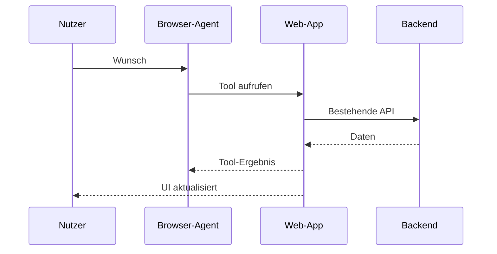

# Der DOM ist keine API

## WebMCP für KI-Agenten

  DevCon Luzern · Oktober 2026

<!--
Willkommen. Heute geht es nicht um "noch ein MCP", sondern um die Frage,
wie Agents sinnvoll mit laufenden Web-Apps zusammenarbeiten können - ohne den
DOM als inoffiziellen API-Vertrag behandeln zu müssen.

Timing: 0:00-0:30
-->

---
layout: center
class: text-left
transition: slide-up
---

Wie kann ein Agent mit einer komplexen Web-App arbeiten,
ohne ihre menschliche Oberfläche
erraten zu müssen?

Beispiel heute: eine Schweizer Wander-App

<!--
Das Zielbild kurz setzen: Die UI bleibt für Menschen zentral. WebMCP soll
Agents nicht von der Seite wegführen, sondern sie in denselben Kontext holen.

Timing: 0:30-1:30
-->

---
layout: center
class: text-left
transition: fade
---

Eine konkrete Absicht

  "Finde mir eine mittelschwere Wanderung in der Zentralschweiz,
  zwischen 8 und 14 Kilometern, maximal vier Stunden und mit mindestens
  500 Höhenmetern."

Für einen Menschen: wenige gezielte Interaktionen. 
Für einen Agenten: Was genau muss er über die Seite wissen?

<!--
Hier Trailfolk kurz mit allen Resultaten und den sichtbaren Filtern zeigen.
Noch keine Live-Demo. Das Publikum soll die Aufgabe verstehen, bevor die
Technik kommt.

Timing: 1:30-3:00
-->

---
layout: two-cols
layoutClass: gap-12
transition: slide-left
---

# Agents lesen Oberflächen

1. Screenshots lesen

2. Verschachtelte DOM-Bäume und Accessibility Tree auswerten

3. IDs, Labels und Controls erraten

4. Klicken, tippen, warten

5. Den resultierenden Zustand erneut auslesen

::right::

Beispielhafte Schrittfolge

1. Finde das passende DOM-Element
2. Öffne das Select
3. Wähle "Zentralschweiz"
4. Finde "Schwierigkeit"
5. Setze "Mittel"
6. Interpretiere Sliders
7. Lies die Resultatliste

  Bildplatzhalter: Screenshot eines Agents mit DOM- oder Accessibility-Tree

<!--
Wichtig: Nicht "Agents scrapen nur". Moderne Browser-Agents haben mehrere
Signale. Die Herausforderung ist trotzdem, dass sie Bedeutung aus
verschachtelten DOM-Bäumen, IDs und einer für Menschen optimierten Oberfläche
rekonstruieren.

Timing: 3:00-5:00
-->

---
layout: two-cols
layoutClass: gap-10
transition: fade
---

# Das funktioniert.

- Funktioniert ohne site-spezifische Integration
- Erschliesst auch ältere Websites
- Nutzt vorhandene Semantik und Accessibility

::right::

# Bis es bricht.

- Labels oder Layout ändern sich
- Dynamische Inhalte laden nach
- Gleichartige Controls sind mehrdeutig
- Sichtbarer und fachlicher Zustand können auseinanderlaufen

Gutes semantisches HTML und Accessibility bleiben unverzichtbar.

<!--
Die Balance bewusst halten. WebMCP ist kein Argument gegen Accessibility.
Eine zugängliche Seite hilft Menschen und UI-automatisierenden Agents.

Timing: 5:00-7:00
-->

---
layout: center
class: text-left
transition: slide-up
---

Die Reibung

UI-Automation zwingt einen Agenten,
die Absicht hinter einer menschlichen
Oberfläche zu rekonstruieren.

Was wäre, wenn die Anwendung ihre ausgewählten Fähigkeiten selbst beschreiben
könnte?

<!--
Das ist der Übergang. Nicht mit einer Definition anfangen, sondern mit der
klaren Problemformulierung.

Timing: 7:00-8:00
-->

---
layout: center
class: text-left
transition: slide-left
---

Was ist WebMCP?

# Web Model Context Protocol

  Eine vorgeschlagene Web-Plattform-API,
  mit der eine laufende Website über <code>document.modelContext</code> ihre
  Daten und Fähigkeiten als strukturierte Tools für Browser-Agents verfügbar
  macht.

  

    
Woher kommt es?

    
Offene Arbeit der W3C Web Machine Learning Community Group; Chrome erprobt die API experimentell.

  

  

    
Die Grundidee

    
Statt Screen-Scraping und geratenen DOM-Details beschreibt die Seite selbst Daten und erlaubte Funktionen.

  

<!--
WebMCP steht für Web Model Context Protocol. Es ist ein offener Vorschlag aus der W3C Web Machine Learning Community Group, nicht der bestehende MCP-Standard und auch noch kein W3C Recommendation Standard. Die API hängt an document.modelContext.

Die Denkweise ist MCP-verwandt: Eine Anwendung beschreibt ihre Fähigkeiten als Tools. Der entscheidende Unterschied ist der Ausführungsort - die laufende Seite im Browser.

Timing: 8:00-10:00
-->

---
layout: default
class: tools-api-slide
transition: slide-up
---

Zwei APIs

# Tools aus JavaScript oder HTML

  

    
Imperativ

    <code class="block mt-5 text-sm">document.modelContext .registerTool(...)</code>
    
Für eigene Client-Logik, Navigation, Zustand und komplexe Abläufe.

  

  

    
Deklarativ

    <code class="block mt-5 text-sm">&lt;form toolname="..." tooldescription="..."&gt;</code>
    
Für bestehende Formulare: Der Browser leitet Tool und Schema aus HTML ab.

  

Beide Varianten halten die Interaktion sichtbar in der Website.

<!--
WebMCP hat zwei Zugänge. Die imperative API definiert Tools mit JavaScript - etwa für komplexe, zustandsbehaftete Anwendungen wie Trailfolk. Die deklarative API annotiert vorhandene HTML-Formulare über toolname und tooldescription; der Browser erzeugt daraus ein strukturiertes Tool.

Timing: 10:00-12:00
-->

---
layout: default
transition: fade
---

Abgrenzung

# MCP und WebMCP arbeiten zusammen.

| | MCP / OpenAPI im Backend | WebMCP im Browser |
|---|---|---|
| Tool lebt bei | Service oder API | Laufender Web-App |
| Gut für | System- und Server-Workflows | UI-, Session- und Kontext-Workflows |
| Benutzeroberfläche | Kann umgangen werden | Bleibt sichtbar und synchron |
| Beispiel | Flug suchen, Zahlung auslösen | Form ausfüllen, Filter setzen, Design bearbeiten |

WebMCP ersetzt keine Backend-Integration. Es ergänzt sie dort, wo der
Browser-Kontext Teil der Aufgabe ist.

<!--
MCP und WebMCP sind keine konkurrierenden Optionen. Wenn ein Dienst eine serverseitige Operation für einen Agenten bereitstellt, ist MCP oder OpenAPI passend. WebMCP setzt dort an, wo die bereits geöffnete Webseite, ihr Zustand, die UI und die Kontrolle des Nutzers wichtig sind.

Timing: 12:00-14:00
-->

---
layout: default
transition: slide-left
---

Gemeinsamer Kontext

  Eine Seite. Ein Zustand.

Mensch, Agent und Seite arbeiten mit demselben sichtbaren Zustand.

<!--
Das ist der wichtigste Unterschied zu einem reinen Backend-Connector.
Die Seite kann ihren Login, ihren aktuellen Kontext und ihre UI weiter selbst
besitzen. Backend-MCP und OpenAPI bleiben für reine Server-Workflows sinnvoll.

Timing: 14:00-16:00
-->

---
layout: center
class: text-left
transition: fade
---

Wann ist WebMCP sinnvoll?

# Wenn der Browser- Kontext zählt.

  

    
Support

    
Komplexe Formulare korrekt finden und vorbefüllen.

  

  

    
Buchungen

    
Mehrere Reisende, Termine und sichtbare Bestätigungsschritte.

  

  

    
Interaktive Anwendungen

    
Filtern, planen, gestalten oder konfigurieren mit geteiltem Zustand.

  

  

    
Entwickler-Tools

    
Diagnosen oder klar begrenzte Aktionen hinter verschachtelten Menüs.

  

Trailfolk ist ein kleines Beispiel für den dritten Fall.

<!--
Diese vier Cases stammen aus der Chrome-Dokumentation: Support-Formulare, komplexe Reisebuchungen, agentische Interaktionen in nutzerorientierten Oberflächen und Diagnosen in Entwickler-Einstellungen.

Das hilft, Trailfolk richtig einzuordnen: nicht der Hauptgrund für WebMCP, sondern ein anschauliches Beispiel für gemeinsame Interaktion in einer zustandsbehafteten UI.

Timing: 16:00-18:00
-->

---
layout: center
class: text-left
transition: slide-up
---

Live-Demo

Trailfolk

  

    
Entdecken

    
Filter sichtbar setzen

    <code class="block mt-6 opacity-75">filter_hikes</code>
    <code class="block mt-2 opacity-75">reset_hike_filters</code>
  

  

    
Inspiration

    
Empfehlungen begründen

    <code class="block mt-6 opacity-75">recommend_hikes</code>
    <code class="block mt-2 opacity-75">show_recommendation_summary</code>
  

Die verfügbaren Tools folgen dem sichtbaren Kontext der Anwendung.

  Bildplatzhalter: Trailfolk-Startansicht mit den Tabs "Entdecken" und "Inspiration"

<!--
Zur Live-Demo wechseln. Der Demo-Teil ist bewusst ein erster Draft:
Welche Prompts letztlich gezeigt werden, kann später angepasst werden.
Der Tab-Wechsel ist aber ein starkes Signal: Die Tool-Oberfläche kann zum
aktuellen Kontext passen.

Timing: 16:00-17:00
-->

---
layout: two-cols
layoutClass: gap-12
transition: fade
---

# Sag, was du willst.

## Nutzerwunsch

> Filtere auf mittelschwere Wanderungen in der Zentralschweiz, zwischen
> 8 und 14 Kilometern, mit mindestens 500 Höhenmetern und höchstens vier
> Stunden Gehzeit.

::right::

## Sichtbar machen

1. Tool-Aufruf mit strukturierten Werten
2. Filter-Chips ändern sich
3. Resultatzahl aktualisiert sich
4. Passende Wanderkarten bleiben sichtbar

Die UI ist nicht nur ein Transportmittel. Sie ist die überprüfbare
Arbeitsfläche für den Nutzer.

  Bildplatzhalter: Trailfolk nach dem Tool-Aufruf mit sichtbaren Filter-Chips und Resultaten

<!--
Live-Demo: Start auf "Entdecken". Das konkrete Prompt kann noch geändert
werden. Wichtig ist der Vorher-/Nachher-Effekt in der UI.

Die aktuelle Trailfolk-API unterstützt minElevation, nicht maxElevation.

Timing: 17:00-22:00
-->

---
layout: two-cols
layoutClass: gap-12
transition: slide-left
---

# Von Treffern zu Empfehlungen.

## Nutzerwunsch

> Empfiehl mir zwei mittelschwere Wanderungen in der Zentralschweiz,
> maximal vier Stunden, mit einem krönenden Dessert danach.

::right::

## Ablauf

1. Zum Tab **Inspiration** wechseln
2. `recommend_hikes` liefert bis zu drei Treffer
3. Der Agent ergänzt Gründe
4. `show_recommendation_summary` schreibt sie an die Karten

Der Agent gibt nicht nur Text zurück. Er versetzt die Anwendung in einen
verständlichen, sichtbaren Zustand.

  Bildplatzhalter: Trailfolk-Empfehlungskarten mit AI-Begründungen

<!--
Live-Demo: Erst den Tab "Inspiration" öffnen, da die Tools kontextabhängig
registriert werden. Diesen zweiten Teil nur zeigen, wenn der erste stabil
gelaufen ist und genug Zeit bleibt.

Timing: 22:00-27:00
-->

---
layout: center
class: text-left
transition: slide-up
---

# Tools sind APIs.

  

    
Ein gutes Tool

    <ul class="text-lg leading-relaxed">
      <li>hat eine fachliche, begrenzte Aufgabe</li>
      <li>fordert nur notwendige Parameter an</li>
      <li>validiert Eingaben klar</li>
      <li>liefert fachlichen Zustand zurück</li>
      <li>hat erkennbare Nebenwirkungen</li>
    </ul>
  

  

    
Trailfolk als Beispiel

    <ul class="text-lg leading-relaxed">
      <li>Distanz, Dauer und Anzahl sind begrenzt</li>
      <li>Schwierigkeit und Region sind kontrollierte Werte</li>
      <li>Empfehlungen sind auf drei begrenzt</li>
      <li>Begründungen referenzieren bekannte Wanderungen</li>
    </ul>
  

Würden wir dieselbe Schnittstelle auch einem externen Entwickler guten
Gewissens geben?

<!--
Jetzt den Engineering-Mehrwert herausarbeiten. Das Tool-Schema ist nicht nur
LLM-Konfiguration, sondern ein API-Vertrag mit Produkt- und Security-Folgen.

Timing: 27:00-30:00
-->

---
layout: two-cols
layoutClass: gap-12
transition: fade
---

# Kein Freipass für Agents.

- Kein Ersatz für ein zugängliches, gut bedienbares UI
- Kein Ersatz für Backend-MCP oder OpenAPI
- Kein Grund, unausgereifte Agenten unbeaufsichtigt handeln zu lassen
- Kein Versprechen für breite Browser-Verfügbarkeit

::right::

# Vertrauen braucht Grenzen.

- Welche Aktionen brauchen Bestätigung?
- Wie klein kann ein Tool-Zugriff sein?
- Was ist untrusted Content?
- Welche Daten darf ein Tool verarbeiten?
- Wie funktioniert ein guter Fallback?

<!--
Ein bewusst nüchterner Moment. Für ein Filter-Tool sind die Risiken gering,
für Kauf, Buchung, Löschen oder Kontoänderungen wesentlich höher.

Timing: 30:00-33:00
-->

---
layout: center
class: text-left
transition: slide-left
---

# Verantwortung ist ein Feature.

  

    
Read

    
Suchen, filtern, erklären

  

  

    
Write

    
Speichern, ändern, teilen

  

  

    
Consequential

    
Kaufen, buchen, löschen

  

Je folgenreicher ein Tool, desto klarer müssen Berechtigung, Bestätigung,
Rückmeldung und Abbruch sein.

<!--
WebMCP kennt Tool-Annotationen und das Thema consequential actions ist im
Entwurf sichtbar. Aber die Anwendung und der Browser-Agent bleiben für die
konkreten Schutzmechanismen verantwortlich.

Timing: 33:00-35:00
-->

---
layout: two-cols
layoutClass: gap-12
transition: slide-up
---

# Experiment mit Rückenwind.

## Spezifikation

**Draft Community Group Report**

W3C Web Machine Learning Community Group

Kein W3C Recommendation Standard. 
Kein formaler Recommendation Track.

::right::

## Implementierungen

- Chrome 149: Origin Trial
- Edge 150: Origin Trial
- Brave Leo: experimentell dokumentiert
- ChatGPT Desktop: dokumentiert

Für Experimente: ja. 
Für breite Produktionsannahmen: noch vorsichtig.

<!--
Diese Folie unmittelbar vor der Konferenz aktualisieren. Die Angaben sind ein
Snapshot vom 10. September 2026 und verändern sich bei experimentellen
Browser-APIs schnell.

Timing: 35:00-37:00
-->

---
layout: center
class: text-left
transition: fade
---

Ausblick

Vielleicht ist das nicht die wichtigste Frage.

Welche Fähigkeiten eurer Web-App sind wertvoll, klar abgegrenzt und
zustandsbehaftet genug, dass ihr sie einem Agenten kontrolliert anbieten
möchtet?

<!--
Nicht auf die Prognose einlassen. Der Wert für das Publikum ist die
Design-Frage, die sie schon heute auf ihre Anwendungen übertragen können.

Timing: 37:00-38:30
-->

---
layout: center
class: text-left
transition: slide-left
---

# Was bleibt?

1. WebMCP macht ausgewählte
Web-Fähigkeiten explizit, statt sie aus der UI erraten zu lassen.

2. Es ergänzt Backend-MCP,
APIs, Accessibility und menschliche Kontrolle - es ersetzt sie nicht.

3. Der Erfolg hängt an
gutem Tool-Design, klaren Grenzen und verantwortungsvoller UX.

<!--
Timing: 38:30-39:30
-->

---
layout: center
class: text-center
transition: fade
---

# Nicht nur Buttons zeigen.

Bewusst Fähigkeiten anbieten.

Quellen: webmachinelearning.github.io/webmcp · github.com/webmachinelearning/webmcp

<!--
Danke. Bei Fragen auf die Demo, Tool-Design oder den experimentellen
Spezifikationsstand eingehen.

Timing: 39:30-40:00
-->
